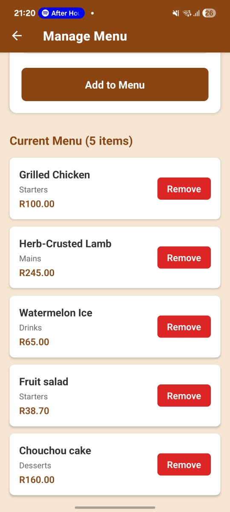

# Christoffel's Menu Management App

Repository: https://github.com/ST10489659/ChefChristoffel-Menu-App 

YouTube Link: [<INSERT_YOUTUBE_VIDEO_URL_HERE>](https://youtu.be/aDhuqBPyqWI?si=LkeVlW7Bz1b5L9EO)

---

## Overview

Christoffel's Menu Management App is a digital menu manager designed for Chef Christoffel's private chef services. It streamlines menu creation and management, provides quick statistics (counts and average prices), and offers an intuitive mobile experience for adding and organizing dishes.

This repository is implemented in TypeScript (100%) and uses Expo + React Native for the mobile frontend and Supabase for persistence.

---

## Features

Core Functionality:

- Menu Management: Add, view, and remove menu items.
- Course Categories: Organize dishes into Starter, Main, and Dessert.
- Real-time Statistics: View total items and average price (overall and per course).
- Advanced Filtering: Filter menu items by course type (All / Starter / Main / Dessert).
- Persistent Storage: Menu data stored in Supabase.
- Sample Data: One‑time "Add Samples" button to populate demo items.

User Experience:

- Intuitive Navigation: Bottom tab navigation to access Menu, Add, and Filter screens.
- Pull-to-Refresh: Manual sync to refresh menu data.
- Confirmation Dialogs: Prevent accidental deletions.
- Form Validation: Immediate validation with helpful error messages.
- Empty & Loading States: Clear feedback when no items or while loading.

Technical Highlights:

- TypeScript: End-to-end type safety.
- React Context: Centralized menu state management.
- Supabase Integration: Secure backend with Row Level Security (RLS).
- Error Handling: Graceful error messages and retry affordances.
- Responsive Design: Optimized for common Android devices.
- Modern UI: Clean, consistent styling with iconography.

---

## Screenshots

---

## Prerequisites

- Node.js v18+ (Recommended)
- npm (or yarn)
- Git
- Expo Go (for device testing)

Recommended tools:

- Visual Studio Code
- Android Studio (for emulator)

Recommended VS Code extensions:

- ESLint
- Prettier
- React Native Tools
- TypeScript React code snippets

---

## Installation & Setup

1. Clone
   git clone https://github.com/ST10489659/ChefChristoffel-Menu-App.git
   cd ChefChristoffel-Menu-App

2. Install
   npm install

3. Database
   The app expects a `menu_items` table with fields:
   - id (UUID)
   - dish_name (text)
   - description (text)
   - course (text: Starter | Main | Dessert)
   - price (numeric)

4. Start
   npx expo start --tunnel
   - Scan the QR code with Expo Go or open in an Android emulator.

---

## Usage

Adding a Menu Item:

1. Open Add tab.
2. Enter Dish Name, Description, select Course, set Price (ZAR).
3. Tap Add — item saved to Supabase and appears in the Menu.

Viewing & Filtering:

- Home (Menu) shows all items with stats. Pull down to refresh.
- Filter tab lets you select All / Starter / Main / Dessert to narrow the list.

Removing Items:

- Tap the trash icon on any MenuItem card.
- Confirm deletion in the prompt.

Sample Data:

- If the menu is empty, use the Add Samples button to insert demo items for testing.
- Example image:

---

## Error Handling & Troubleshooting

- TypeScript errors: run npm run typecheck and fix reported issues.
- Expo caching/problems: expo start -c

---

## Attribution & Resources

Core technologies: React Native, Expo, TypeScript, Supabase.  
Libraries: @supabase/supabase-js, expo-router, lucide-react-native.

Documentation references:

- React Native Docs — https://reactnative.dev
- Expo Docs — https://docs.expo.dev
- TypeScript — https://www.typescriptlang.org

---

## References

### Core Technologies

React Native  
Meta Platforms, Inc. (2025) *React Native: A framework for building native apps using React*. Available at: https://reactnative.dev/ (Accessed: 22 October 2025).

Expo  
Expo (2025) *Expo Documentation: Tools and services for React Native*. Available at: https://docs.expo.dev/ (Accessed: 22 October 2025).

TypeScript  
Microsoft Corporation (2025) *TypeScript: JavaScript with syntax for types*. Available at: https://www.typescriptlang.org/docs/ (Accessed: 22 October 2025).

---

### Navigation and Routing

React Navigation  
React Navigation Contributors (2025) *React Navigation: Routing and navigation for React Native apps*. Available at: https://reactnavigation.org/docs/getting-started (Accessed: 22 October 2025).

React Navigation Native Stack  
React Navigation Contributors (2025) *Native Stack Navigator*. Available at: https://reactnavigation.org/docs/native-stack-navigator (Accessed: 22 October 2025).

---

### Data Storage and State Management

AsyncStorage  
React Native Community (2025) *@react-native-async-storage/async-storage: Asynchronous, persistent, key-value storage system for React Native*. Available at: https://react-native-async-storage.github.io/async-storage/ (Accessed: 22 October 2025).

React Hooks  
Meta Platforms, Inc. (2025) *Hooks API Reference*. Available at: https://react.dev/reference/react/hooks (Accessed: 22 October 2025).

---

### UI Components and Styling

React Native Core Components  
Meta Platforms, Inc. (2025) *Core Components and APIs*. Available at: https://reactnative.dev/docs/components-and-apis (Accessed: 22 October 2025).

React Native StyleSheet  
Meta Platforms, Inc. (2025) *StyleSheet: React Native styling API*. Available at: https://reactnative.dev/docs/stylesheet (Accessed: 22 October 2025).

React Native Safe Area Context  
Th3rd Wave (2025) *react-native-safe-area-context: A flexible way to handle safe area insets*. Available at: https://github.com/th3rdwave/react-native-safe-area-context (Accessed: 22 October 2025).

React Native Screens  
Software Mansion (2025) *react-native-screens: Native navigation primitives for React Native*. Available at: https://github.com/software-mansion/react-native-screens (Accessed: 22 October 2025).

---

### Programming Concepts and Patterns

Array Methods  
Mozilla Developer Network (2025) *Array - JavaScript | MDN*. Available at: https://developer.mozilla.org/en-US/docs/Web/JavaScript/Reference/Global_Objects/Array (Accessed: 22 October 2025).

Async/Await  
Mozilla Developer Network (2025) *async function - JavaScript | MDN*. Available at: https://developer.mozilla.org/en-US/docs/Web/JavaScript/Reference/Statements/async_function (Accessed: 22 October 2025).

Arrow Functions  
Mozilla Developer Network (2025) *Arrow function expressions - JavaScript | MDN*. Available at: https://developer.mozilla.org/en-US/docs/Web/JavaScript/Reference/Functions/Arrow_functions (Accessed: 22 October 2025).

Destructuring Assignment  
Mozilla Developer Network (2025) *Destructuring assignment - JavaScript | MDN*. Available at: https://developer.mozilla.org/en-US/docs/Web/JavaScript/Reference/Operators/Destructuring_assignment (Accessed: 22 October 2025).

---

### Design and User Experience

Mobile UI Design Patterns  
Nielsen Norman Group (2025) *Mobile User Experience*. Available at: https://www.nngroup.com/articles/mobile-ux/ (Accessed: 22 October 2025).

iOS Human Interface Guidelines  
Apple Inc. (2025) *Human Interface Guidelines*. Available at: https://developer.apple.com/design/human-interface-guidelines/ (Accessed: 22 October 2025).

Material Design for Android  
Google LLC (2025) *Material Design*. Available at: https://m3.material.io/ (Accessed: 22 October 2025).

---

### Version Control and Collaboration

Git  
Software Freedom Conservancy (2025) *Git Documentation*. Available at: https://git-scm.com/doc (Accessed: 22 October 2025).

GitHub  
GitHub, Inc. (2025) *GitHub Docs*. Available at: https://docs.github.com/ (Accessed: 22 October 2025).

---

### Additional Resources

React Native Tutorial — https://reactnative.dev/docs/tutorial (Accessed: 22 October 2025)  
Expo Tutorial — https://docs.expo.dev/tutorial/introduction/ (Accessed: 22 October 2025)  
TypeScript for React Native — https://reactnative.dev/docs/typescript (Accessed: 22 October 2025)

---
